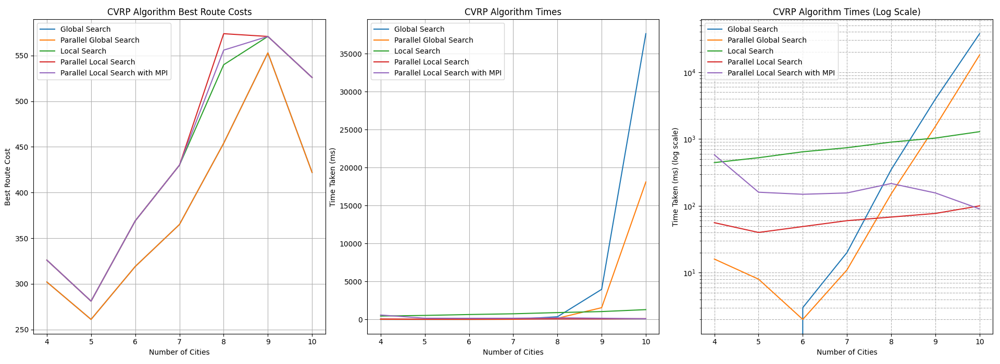

# Capacitated Vehicle Routing Problem (CVRP) - Strategy and Implementation Details

## Introduction

The Capacitated Vehicle Routing Problem (CVRP) is an optimization challenge aimed at finding the most efficient routes for a fleet of vehicles tasked with delivering goods to various locations. This report delves into the strategies and implementations used to solve CVRP, with a focus on heuristic methods, local and global search algorithms, and parallelization techniques.

## Methodologies Employed

### 1. Global Search
- **Strategy**: This approach exhaustively searches all possible combinations of routes that satisfy the given constraints, such as vehicle capacity and maximum stops per route.
- **Implementation**: The method starts from a base location (typically the depot, assumed here as place 0) and recursively explores all viable routes until all places are visited or no further valid routes can be constructed.
- **Data Handling**: Utilizes recursive functions to build routes and applies constraints checking at each step to ensure feasibility.

### 2. Parallel Global Search
- **Enhancements**: Extends the basic global search by incorporating parallel computing techniques, specifically OpenMP for threading and MPI for inter-process communication.
- **Distribution Strategy**: Workloads are distributed among multiple processes, where each process is responsible for exploring a different segment of possible routes.
- **Parallelization Benefits**: Aims to accelerate the route finding process by leveraging multiple CPUs or machines, effectively reducing computation time.

### 3. Local Search
- **Heuristic Approach**: This method employs a heuristic strategy, predominantly using a greedy heuristic that selects the next best step based on immediate, local conditions to construct an initial feasible route quickly. The heuristic focuses on finding a good, though not necessarily optimal, solution.
- **Decision Making**: Decisions in this strategy are primarily driven by a greedy heuristic, optimizing the route incrementally by choosing the lowest-cost or most efficient next step from the current location.
- **Exploration Techniques**: To avoid getting trapped in local optima, the algorithm includes a randomization mechanism. Specifically, there is a 50% chance of following the greedy heuristic to select the next step, and a 50% chance of choosing a path randomly. This randomness allows the algorithm to explore alternative, less obvious paths which might lead to better overall solutions.

### 4. Parallel Local Search
- **Integration of Parallel Technologies**: This approach leverages both MPI (Message Passing Interface) and OpenMP (Open Multi-Processing) for parallel execution. MPI is used for distributing the local search tasks across different processors or nodes, while OpenMP is employed within each node to exploit multi-threaded processing capabilities.
- **Independent Computations**: Each processor conducts its own local search independently. This decentralized approach allows each processor to explore a unique part of the solution space, utilizing both the greedy heuristic and randomization independently.
- **Optimization**: The parallel local search strategy aims to enhance both the quality of the solution and the speed of computation. By allowing multiple processors to independently tackle different parts of the search space, the approach can more effectively find the best possible solution by aggregating the best results from each processor. The integration of randomized decisions alongside the heuristic increases the diversity of solutions explored, enhancing the potential to find a globally optimal route.

## Implementation Details

### Data Structures
- **Place, Load, and Cost**: Simple aliases for `int`, used to represent different attributes of places within the routing problem.
- **Route and Road**: Structs managing sequences of places and travel costs, central to route planning and optimization.

### Parameters
- **Vehicle Capacity**: The maximum load that a vehicle can carry, defining the constraint for each route. Set to 20 in the implementation.
- **Max Number of Places Per Route**: The maximum number of places that can be visited in a single route. Set to 3 in the implementation. 

### Core Methods
- **`solve()`**: The primary function that orchestrates the routing algorithm, initiating the appropriate search strategy.
- **`generateAllRouteCombinationsWithRestrictions()`**: Employs in global search to recursively generate all possible route combinations, considering constraints.
- **`generateRouteAndCost()`**: Utilized in local search to construct a route based on heuristic or randomized logic.

### Key Concepts
- **Recursive Search**: Fundamental to global search, this involves exploring all combinations until constraints are violated or a complete tour is achieved.
- **Heuristic and Randomized Decisions**: Core to local search, where the algorithm may choose to deviate from the typical greedy approach to potentially discover better routes.
- **Parallel Processing**: Critical in both global and local search methods in a parallel context, enabling the algorithm to efficiently tackle larger problems by dividing the computational load.

## How to run the Code
- **Compilation**: The code can be compiled using the provided `Makefile` by running `make` in the terminal inside the implementation directory.
- **Execution**: The compiled executable can be run using the command `mpirun -np <num_processes> ./main`, where `<num_processes>` is the number of MPI processes to be used.

## Performance Analysis

The performance of the different CVRP implementations was evaluated based on the best route costs and the time taken to compute these routes. The results are summarized in the following chart:

### 1. Global Search
The global search method produced the best route costs for small numbers of cities, but its performance degraded significantly as the number of cities increased. The time taken for computations rose exponentially, making it impractical for larger problems.

### 2. Parallel Global Search
Parallel global search with OpenMP demonstrated improved performance over the basic global search. The use of parallel threads reduced computation times, but the method still struggled with larger instances due to the inherent complexity of exploring all possible route combinations.

#### Parallel Global Search with MPI
Unfortunately, it wasn't possible to implement parallelization with MPI for the global search algorithm due to the challenges posed by its recursive nature. Recursion complicates the distribution of workload among multiple processors because each recursive call depends on the results of the previous calls. This dependency chain is difficult to manage in a parallel computing environment.

However, a future implementation using iterative loops instead of recursion could potentially overcome this limitation. Iterative algorithms are more naturally parallelizable as they can often be broken down into independent tasks that can be distributed among processors. This reimplementation could make parallel global search with MPI a viable option for large-scale CVRP problems.

### 3. Local Search
Local search provided a good balance between solution quality and computation time. The heuristic approach quickly found feasible routes, and the addition of randomness helped avoid local optima. This method showed stable performance as the number of cities increased, although the quality of the routes was sometimes suboptimal compared to global search.

### 4. Parallel Local Search
I have created two Parallel Local Searches: one using only OpenMP and another using both OpenMP and MPI.

#### Parallel Local Search with OpenMP
This method leveraged multi-threading to distribute the computation of the local search across multiple threads. This approach efficiently improved performance by reducing computation times and providing good route costs.

### 4. Parallel Local Search

I have created two Parallel Local Searches: one using only OpenMP and another using both OpenMP and MPI.

#### Parallel Local Search with OpenMP
This method leveraged multi-threading to distribute the computation of the local search across multiple threads. This approach efficiently improved performance by reducing computation times and providing good route costs.

#### Parallel Local Search with OpenMP and MPI
This implementation utilized both OpenMP and MPI for parallel execution. MPI distributed the local search tasks across different processors or nodes, while OpenMP was employed within each node to exploit multi-threaded processing capabilities. However, the use of MPI made the execution more sensitive to network capabilities, which introduced some variability in performance. For smaller networks, this sensitivity sometimes led to higher execution times due to network overhead. Despite this, the implementation still showed performance improvements compared to the non-parallel implementation, but the parallel implementation using only OpenMP consistently outperformed the MPI-based approach in terms of stability and efficiency. 

---

## Conclusion

The CVRP implementations explored here demonstrate the application of exhaustive search strategies and heuristic approaches, enhanced by modern parallel computing techniques. By leveraging MPI and OpenMP, the solutions are not only viable for large-scale problems but are also optimized for performance, showcasing a robust framework capable of addressing complex logistical challenges. The creation of two distinct parallel local search methods—one using only OpenMP and the other combining OpenMP and MPI—highlights the potential for significant performance improvements through advanced parallelization strategies. The OpenMP-only implementation proved to be more stable and efficient, while the MPI-enhanced approach showed potential but was impacted by network sensitivities.
